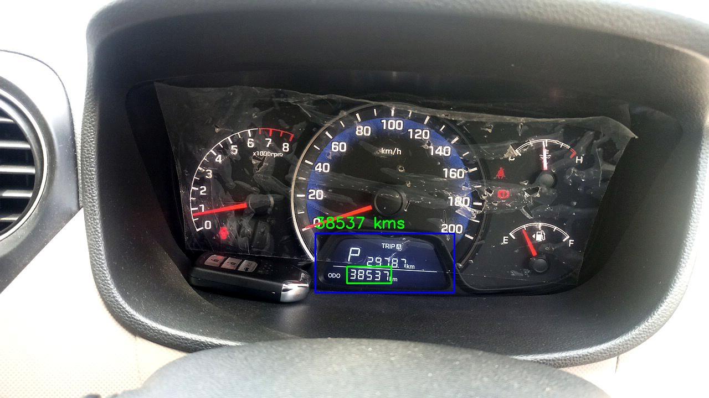
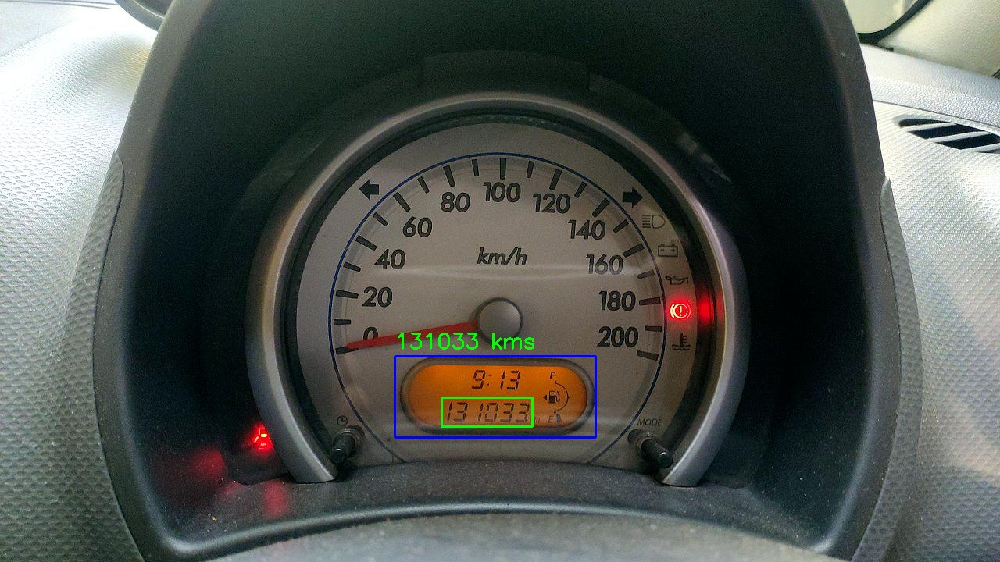
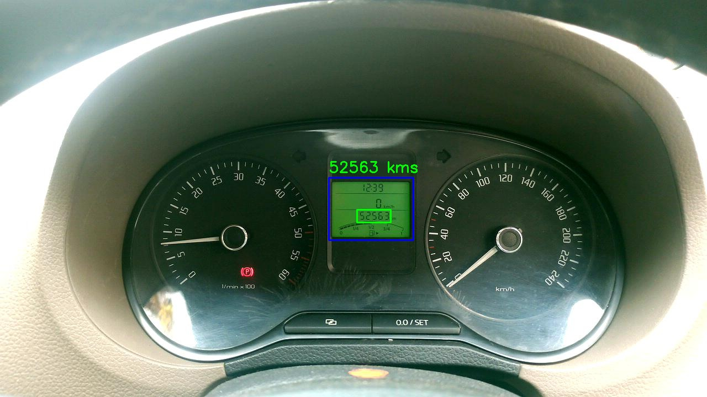

# Vehicle Dashboard Odometer Reader
## Project Overview
This project focuses on the automated detection and recognition of odometer readings from vehicle dashboard images. By leveraging state-of-the-art object detection and optical character recognition (OCR) models, the solution is broken down into three key stages:

1. LCD Screen Detection from the dashboard image.
2. Odometer Reading Detection within the cropped LCD screen.
3. Text Extraction (OCR) to retrieve the odometer reading from the detected region.

The project applies object detection, OCR, and pipeline development techniques to address real-world challenges such as glare, blur, and tightly cropped images.


## Problem Statement
Accurately identifying and reading odometer values from car dashboard images poses challenges such as varying lighting conditions, image quality, and dashboard designs. The goal of this project was to create a robust solution capable of handling these conditions with high precision.

## Solution Approach
### 1. LCD Screen Detection
In this first step, the LCD screen containing the odometer reading is detected in the vehicle dashboard image.

* Format: Images were annotated in YOLO format.
* Training Images: 3,500
* Validation Images: 350
* Models Used: YOLOv5s and YOLOv5-nano (nano selected due to its smaller size and comparable performance).


### 2. Odometer Reading Detection
Once the LCD screen is detected, the odometer reading is located within the cropped LCD region.

* Training Images: 2,500
* Validation Images: 119
* Model Used: YOLOv5-nano

### 3. OCR for Odometer Text Extraction
For the final step, PaddleOCR was employed to extract the numerical text from the detected odometer region. PaddleOCR is known for its robustness in extracting text from varied image types, making it ideal for this task.

## Directory Structure
```
vehicle-dashboard-odometer-reader/
│
├── data/                    
│   ├── lcd_screen_detection/      # Sample images and annotations for LCD screen detection
│   ├── odometer_detection/        # Sample images and annotations for odometer reading detection
│   ├── sample_test_images/        # A few test images
│   └── sample_test_images_results/ # Prediction of the test images
│
├── models/                       
│   ├── yolov5_lcd.pt             # Trained YOLOv5 model for LCD screen detection
│   └── yolov5_odometer.pt        # Trained YOLOv5 model for odometer reading detection
│
├── test_predict.py               # Script for running inference on test images
├── setup.txt                     # Setup instructions, dependencies, and usage info
├── README.md                     # Project description and workflow
├── sample_test_images_results.csv # CSV output of predictions and results
└── LICENSE                       # Project license
```

## Error Cases and Limitations
* Image Quality: Glare or blur in dashboard images impacted the OCR’s ability to extract accurate text.
* Tight Cropping: Overly tight bounding boxes for the odometer led to OCR inaccuracies.
   
## Running Inference
To run inference on a set of test images:
1. Update the paths in `test_predict.py`:

    `image_dir_path`: Path to the test images.  
    `csv_file_path`: Path where the results dataframe will be saved.

2. Execute the script to predict odometer readings. The results will be saved in the specified CSV file.

## YOLO Model Parameters
* Confidence Threshold (conf=0.75): Controls the probability threshold for filtering predictions, where higher values reduce false positives.
* IoU Threshold (iou=0.1): Low IoU is set to allow more leniency in detecting overlapping objects.
* Max Detections (max_det=1): Limited to one detection per image, optimized for odometer reading scenarios.

## Sample Results

Here are some examples of the odometer readings detected:

### Example 1:


### Example 2:


### Example 3:


## Conclusion
This project demonstrates an efficient approach to odometer reading using object detection and OCR techniques, with a focus on model optimization and addressing real-world challenges.